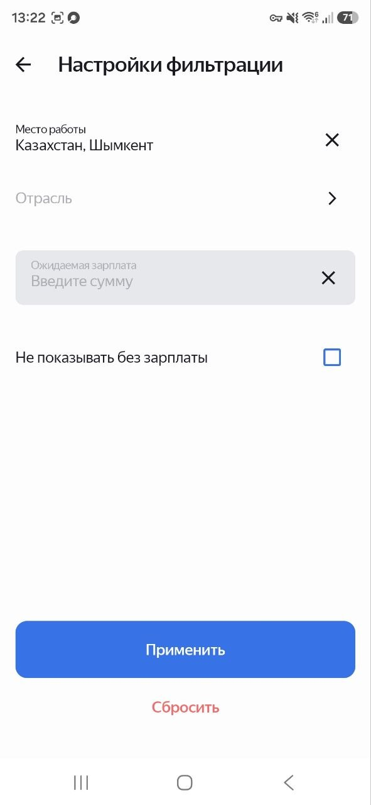
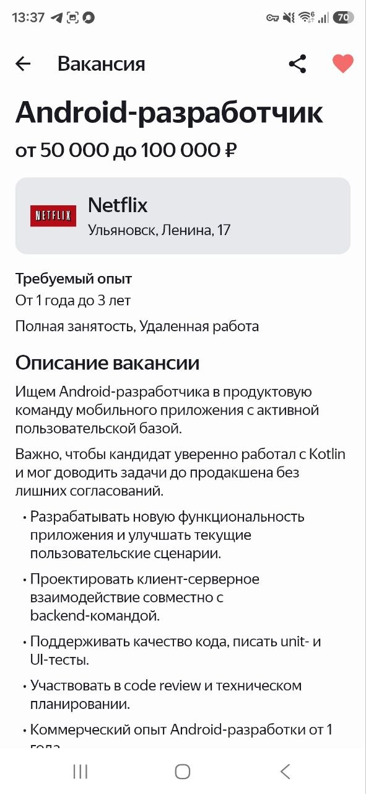

# 💼 Job Exchange

**Job Exchange** is an Android application for searching and managing job vacancies.

The app allows users to search for vacancies, apply filters, view detailed information, and save interesting vacancies to favorites.

## ✨ Features

* 🔎 **Vacancy Search** — search vacancies by keywords
* 🎛️ **Filtering** — filter vacancies by country, region, industry, and workplace type
* 📄 **Vacancy Details** — view detailed vacancy information, salary, company, requirements, and contacts
* ❤️ **Favorites** — save and manage favorite vacancies locally
* 🌐 **Network Handling** — handle network availability and API errors
* 👥 **Team Screen** — view project team members

## 🛠 Tech Stack

* **Kotlin**
* **Jetpack Compose + Material 3** — UI
* **MVVM** — presentation architecture
* **Kotlin Coroutines** — asynchronous operations
* **Retrofit** — network requests
* **Room** — local database
* **Koin** — dependency injection
* **Navigation Component** — screen navigation
* **Coil** — image loading
* **Java / JVM:** 17
* **Min Android API:** 29

## 🏗 Architecture

The project follows a layered architecture with separation of presentation, domain, and data responsibilities.

```text
UI
 ↓
ViewModel
 ↓
Interactor
 ↓
Repository
 ↓
Data source
```

Main layers:

* `presentation` — ViewModels and UI state
* `ui` — Jetpack Compose screens and reusable UI components
* `domain` — business logic, interfaces, and domain models
* `data` — API, Room database, repositories, DTOs, and mappers
* `di` — Koin dependency injection modules

## 💾 Data

The app works with both remote and local data sources:

* 🌐 **Remote:** vacancy API accessed via Retrofit
* 💾 **Local:** Room database for favorite vacancies
* ⚙️ **Local storage:** saved filtration parameters

## 🔑 API Configuration

The app requires an API access token to search for vacancies.

To run the application locally:

1. Get an API access token from the [API authorization page](https://android-diploma.education-services.ru/login).
2. Create a `develop.properties` file in the project root.
3. Add the following property:

```properties
apiAccessToken=my_access_token
```

Replace `my_access_token` with your personal token.

> **Important:** `develop.properties` contains a secret token and must not be committed to version control or shared publicly.

## 📱 Screenshots

| 🔎 Vacancy Search                                | ❤️ Favorites                                        |
| ------------------------------------------------ | --------------------------------------------------- |
|  |  |

| 🎛️ Filter Settings                                                    | 📄 Vacancy Details                                               |
|------------------------------------------------------------------------|------------------------------------------------------------------|
|  |  |

| 👥 Team                                                |
|------------------------------------------------------------------------| 
|  | 

## 🚀 Build

### Requirements

* Android Studio
* JDK 17
* Android SDK 36
* Android 10 / API 29+

### Build debug APK

Linux / macOS:

```bash
./gradlew assembleDebug
```

Windows:

```bat
gradlew.bat assembleDebug
```

## 👩‍💻 Team

**[valtherys](https://github.com/valtherys)**
**[denzelandrioki](https://github.com/denzelandrioki)**
**[h0mepvnk](https://github.com/h0mepvnk)**
**[Deathriot](https://github.com/Deathriot)**

